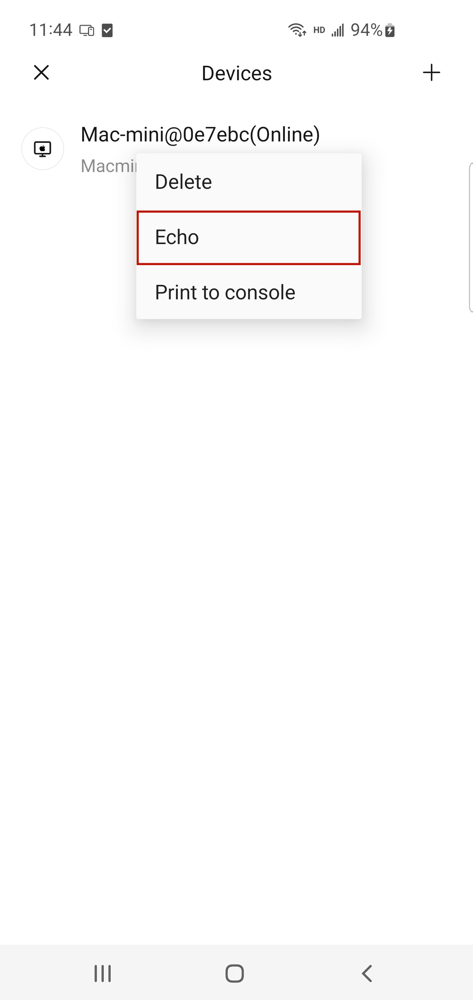

# Android Setup SMS Source FAQ

## Problem description

Android phone has been granted SMS permission but still unable to synchronize messages when receiving SMS notifications. How to solve this problem?

## Solution

### Unable to synchronize when the application is in the foreground

If the device is running in the foreground, SMS synchronization cannot be performed. You can troubleshoot by following these steps:

1、First, please check if your devices are all properly connected and on the same local network (check if the IP addresses of the two devices match). If they are not on the same local network, please connect both devices to the same local network before trying again.

2、Open the **Octoclip** app，Click **More** to enter the More interface.

3、Click on **Device**, jump to the device interface, long press the device you want to sync will bring up a dialog box, click on **Echo** in the dialog box, observe if the paired device triggers an echo operation.

4、If the echo operation is triggered but synchronization still cannot be performed, you can kill the **Octoclip** application and restart it. If the echo is not triggered, please check if the network connection is good first.

### When the application is in the background or not running, synchronization cannot be performed

If your device is not running in the foreground, but cannot achieve SMS synchronization. It may be because the phone manufacturer optimizes aspects such as battery and permissions of the phone system, which may prevent **Octoclip** from waking up successfully when receiving messages, thus failing to synchronize. You can troubleshoot by following these steps:

> Note: The device interface and operation methods provided in the text are for reference only. The actual situation may vary with device updates, so please refer to the actual situation.

Different devices have different operating methods, you can refer to the specific operation instructions for each device.

- [Vivo](./sms-sync-vivo.md)
- [Xiaomi](./sms-sync-xiaomi.md)
- [Samsung](./sms-sync-samsung.md)
- [ZTE](./sms-sync-zte.md)
