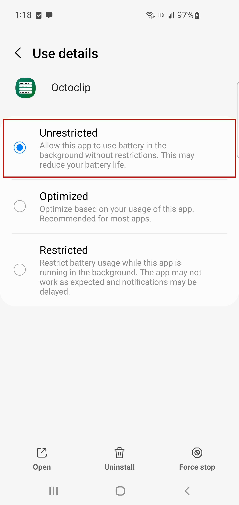

# Samsung

## Turn off power saving mode

1. Open the **Settings** app

2. Click on **Apps**.

3. Find and click on **Octoclip**.

4. Click on **Battery**, and select the option **Unrestricted**.

   
