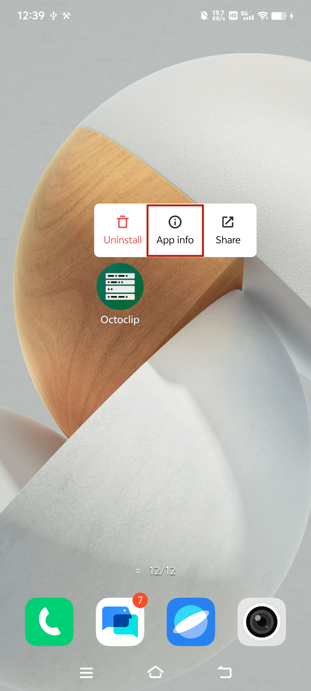
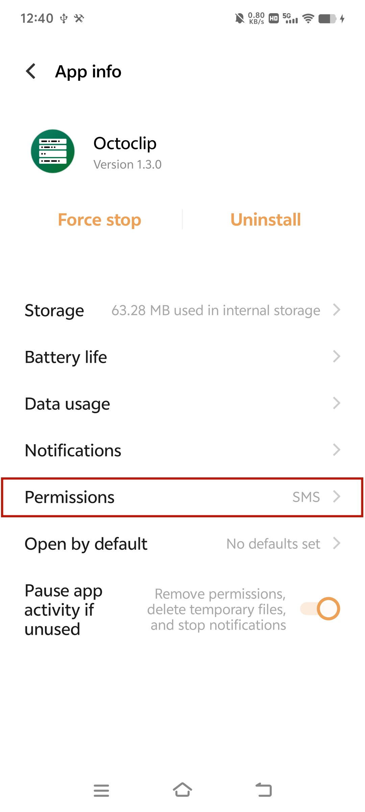
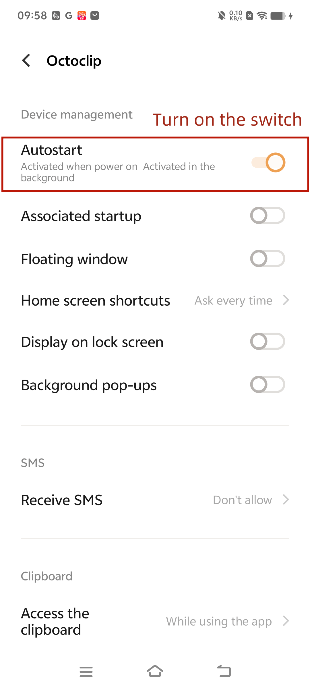

# Vivo

## Auto-start management

1. Find **Octoclip** on the desktop and long press to display the menu.

   

2. Click on **App Info** in the menu to enter the related settings page.

   

3. Click on **Permissions**, after entering the page, click on **All Permissions**.

   

4. Turn on the **Autostart** option.
