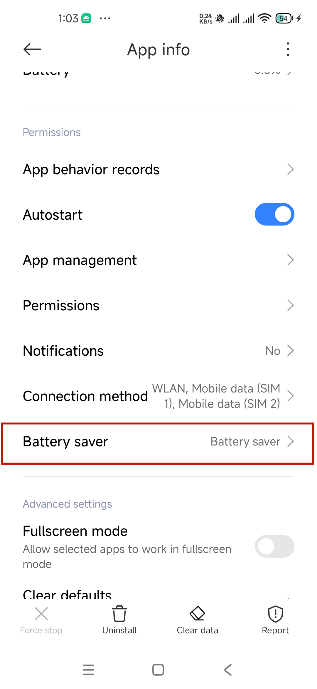

# Xiaomi

## Auto-start management

1. Open the **Settings** app.

2. Click **Apps**.

   

3. Click on **Autostart**.

   

4. Find and confirm that the **Octoclip** column is in the on state.

   

## Turn off power saving mode

1. Open the **Settings** app.

2. Click **Apps**.

   

3. Find **Octoclip** in the list of applications.

   

4. Click and open the **Octoclip** application information interface, find the **Battery saver**.

   

5. Click on **Battery saver**, select the **No restrictions** option.

   
