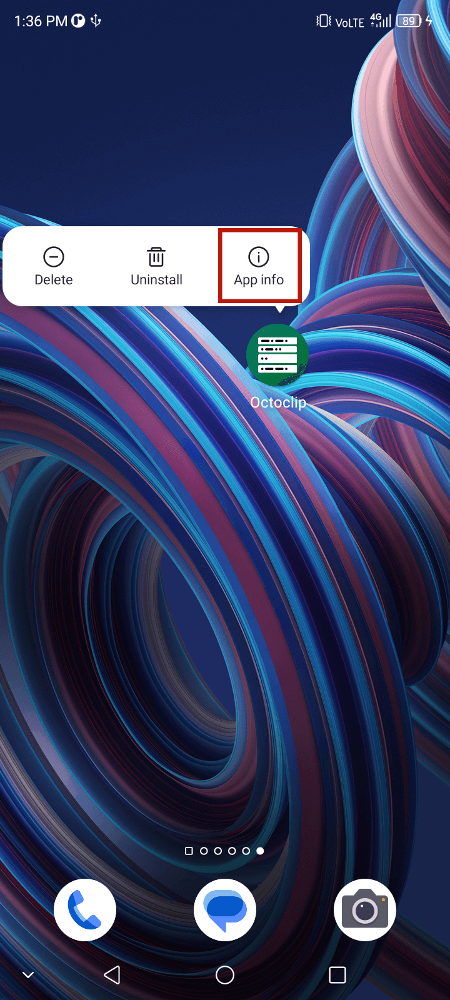
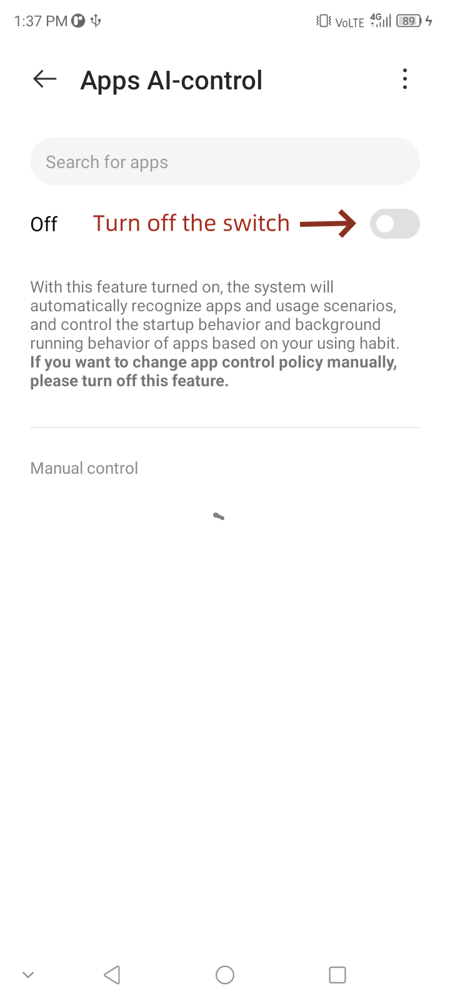
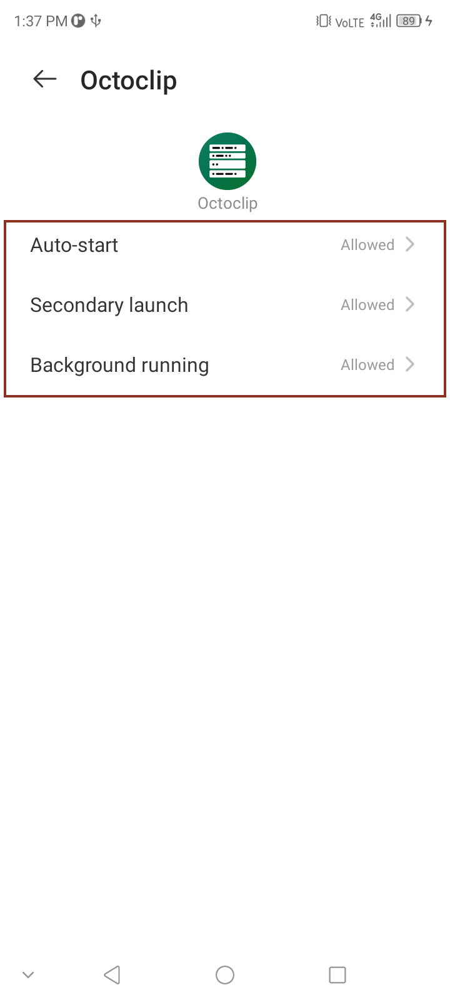

# ZTE

## Auto-start management

1. Find **Octoclip** on the desktop and long press the icon until the menu appears.

   

2. Click on **App Info**.

3. Click on **Battery**, and then click on **Battery optimization**.

4. Turn off the battery optimization interface switch and find **Octoclip**.

   

5. Click on **Octoclip**, adjust the settings of **Auto-start**, **Secondary launch**, and **Background running** to the column of **Allowed**.

  
