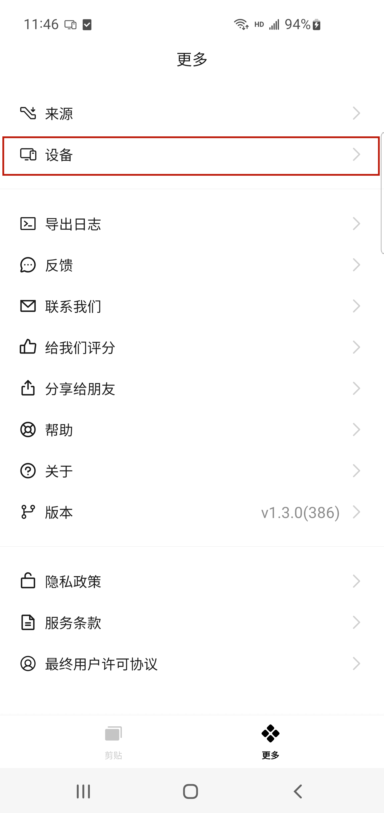
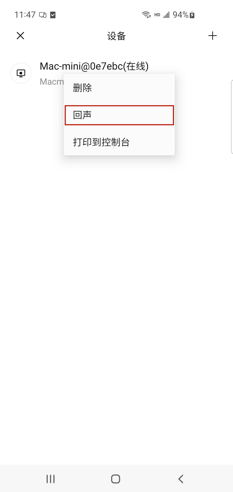

# Android 配置短信来源常见问题

## 问题描述

安卓手机授予了短信权限但在收到短信通知的时候，还是无法进行短信同步该如何解决。

## 解决办法

### 应用在前台时无法进行同步

如果设备运行在前台时，无法进行短信同步，可以按以下步骤进行排查：

1、首先请先检查您的设备是否都在正常连接并在同一个局域网下（查看两台设备的IP是否一致）。如果不在同一局域网下，请先将两台设备连接至同一个局域网下再进行重试。

2、打开 章鱼速贴 应用，点击 **更多**，进入到更多界面。

3、点击 **设备** ，跳转到设备界面，长按想要同步的设备会出现一个弹框，点击弹框中的**回声**，观察配对设备是否有触发回声操作。

4、如果有触发回声操作，但还是无法进行同步，可以先杀死 **章鱼速贴** 应用返回重新启动。如果未能出发回声，请先检查网络链接是否良好。

### 应用在后台时或未运行时无法进行同步

如果你的设备未运行在前台，但无法实现短信同步的话。可能是因为手机厂商对手机系统电量、权限等方面的优化，会导致在接受到短信的时候，无法成功换醒**章鱼速贴** 从而未能实现同步。你可按以下步骤进行排查：

> 说明：文中提供的设备界面及操作方法仅供参考，实际情况可能随设备更新而有所不同，请以实际情况为准。

不同设备操作方式不同，可分别查看以下设备的针对性操作指引。

- [Vivo 手机](./sms-sync-vivo.md)
- [小米手机](./sms-sync-xiaomi.md)
- [三星手机](./sms-sync-samsung.md)
- [中兴手机](./sms-sync-zte.md)
