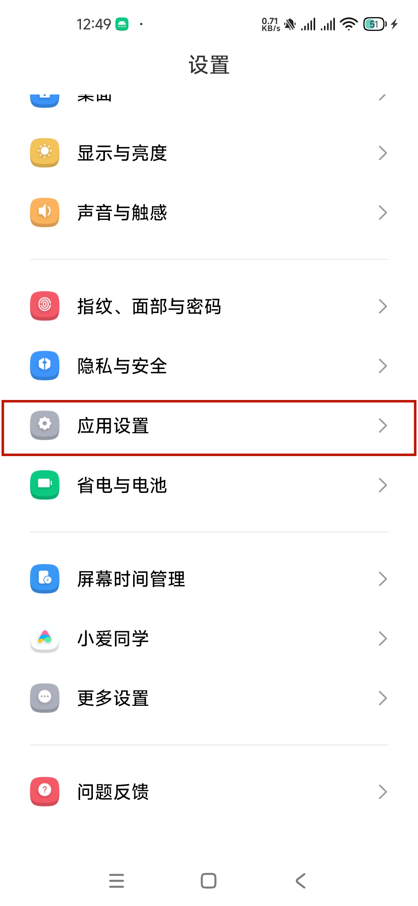
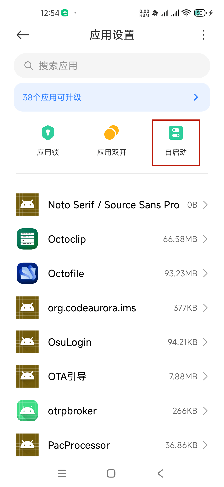
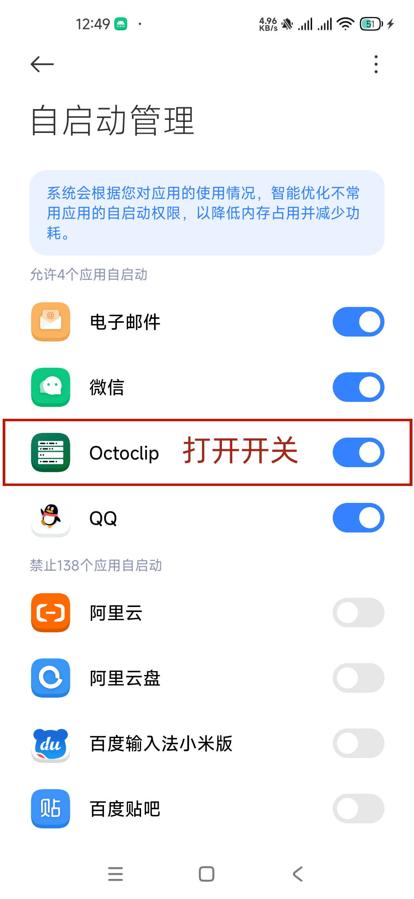
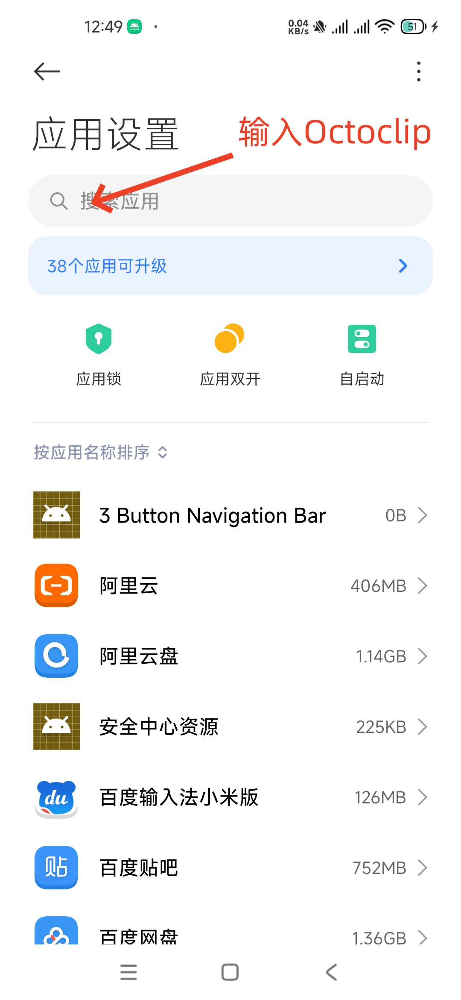
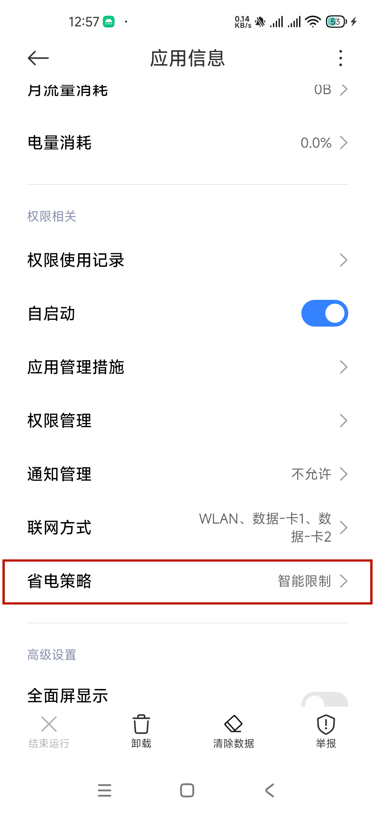
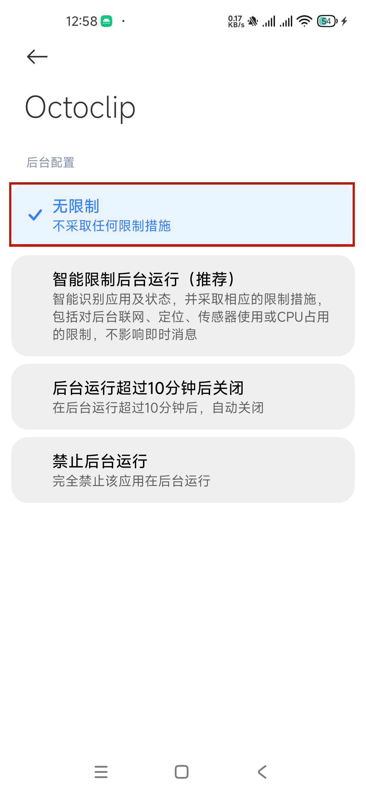

# 小米手机

## 应用启动管理

1. 打开 **设置** 应用。

2. 点击 **应用设置**。

   

3. 点击 **自启动管理**。

   

4. 找到并确认 **章鱼速贴** 一栏为开启状态。

   

## 关闭省电模式

1. 打开 **设置** 应用。

2. 点击 **应用设置**。

   

3. 在应用列表中找到 **章鱼速贴**

   

4. 点击并打开 **章鱼速贴** 应用信息界面，找到 **省电策略**

   

5. 点击 **省电策略** ，选择 **无限制**  一栏

   
