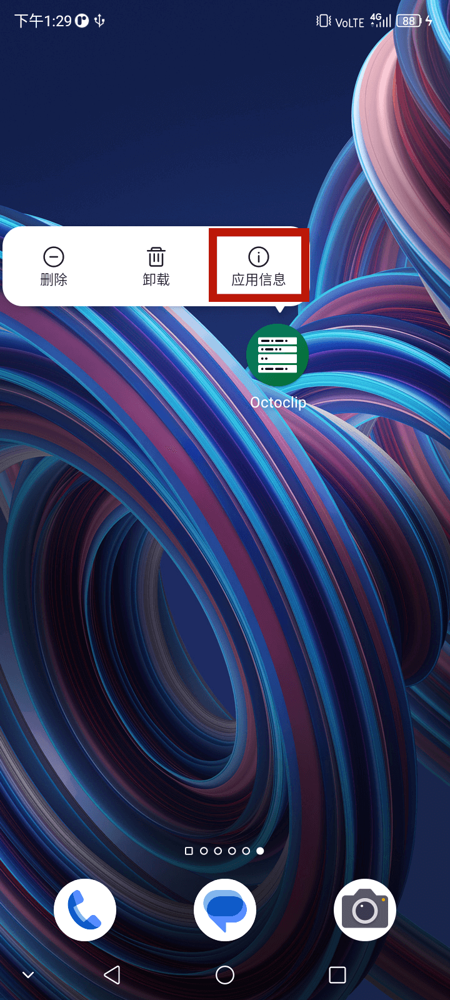
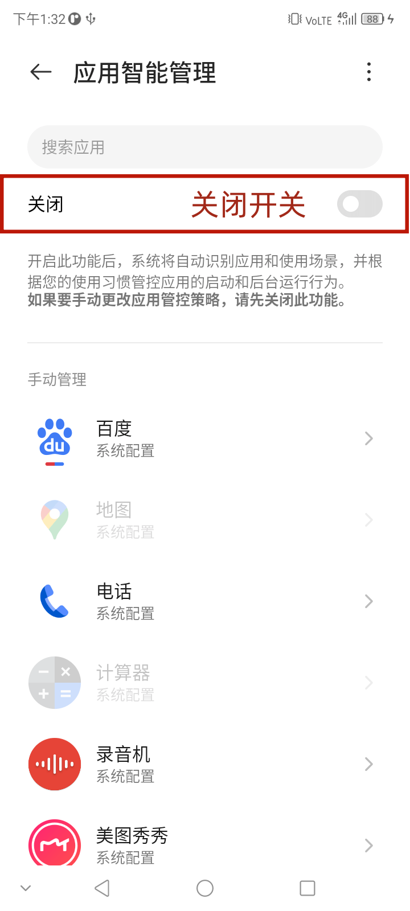
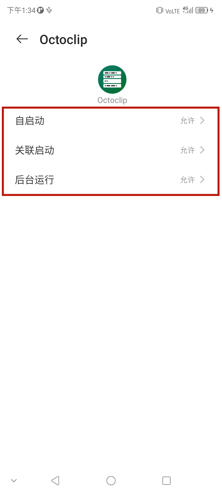

# 中兴手机

## 关闭电池优化

1. 在桌面上找到 **章鱼速贴** ，并长按图标直到显示菜单

   

2. 点击 **应用信息**。

3. 点击 **电池** ，并点击进入 **电池优化**。

4. 将电池优化界面开关关闭，并找到 **章鱼速贴** 。

   

5. 点击 **章鱼速贴** ，将 **自启动** 、**关联启动**、**后台运行** 三项的调整到 **允许** 一栏。

